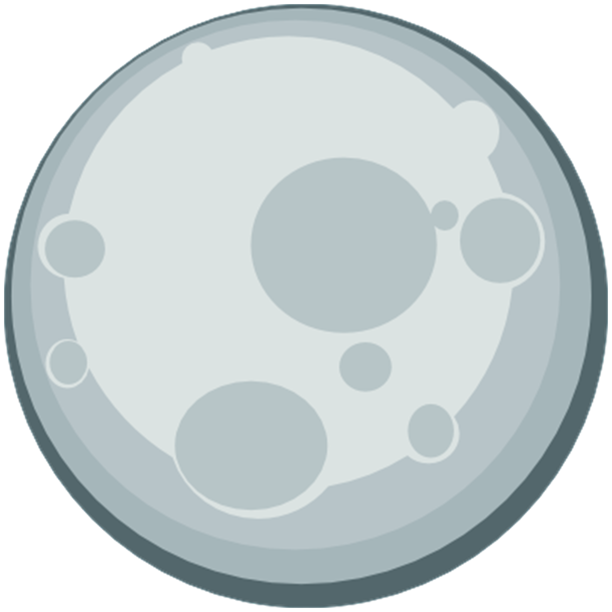

<h1 align="center">Helios Launcher</h1>

[
](https://github.com/DevBen29/NightMC-launcher/actions) 

## Téléchargement

Vous pouvez télécharger depuis [GitHub Releases](https://github.com/DevBen29/NightMC-launcher/releases)
